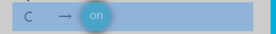
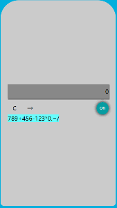

# 做完这个小demo的一些总结


## demo的思路

### 样式方面

1. 用flex布局

    项目分为上下两个块  
    被`class`为`warp`的块包裹

    ```html
    <div calss="warp">
        <div class="top">
            <!-- 存放显示屏，开关，退格，清零等按钮 -->
        </div>
        <div class="keys">
            <!-- 存放数字按钮以及加减乘除等操作符 -->
        </div>
    <div>
    ```

   ```css
    #warp {
    display: flex;
    flex-direction: column;
    /*默认主轴从左指向右这个属性让主轴方向从上指向下*/
    justify-content: center;
    /*让项目从主轴的中部开始排列*/
    width: 280px;
    height: 550px;
    margin: 1vh auto;
    background-color: #ccc;
    padding: 10px 20px;
    border-radius: 50px 50px 10px 10px;
    overflow: hidden;
    }
    ```

    `top`块又包裹了两个块  
    一个用来实时显示按钮对应的文本  
    另一个包裹了功能按钮包括*开关*，*退格*，*清零*
    当然他们也是弹性盒子
     

    ```html
     <div class="top">
      <div class=" screen">
        <span>0<span>
      </div>
      <div class="top-fun">
        <div class="top-left-fun">
          <!-- clear div -->
          <!-- backspace div -->
        </div>
        <div class="switch" onclick=" ">
          <div class="on">on</div>
        </div>
      </div>
    ```

    ```css
    #warp
    .top {
        /*主轴从上向下 从主轴中部开始排列 */
        display: flex;
        flex-direction: column;
        justify-content: center;
    }
    .top
    .top-fun {
        /*主轴从左指向右 */
        display: flex;
    }

    .top-left-fun {
        align-items: stretch;
        flex-grow: 1;
        /* 会占据主轴的空白位置 */
    }
    ```

    flex弹性盒子设置垂直居中  
    在开关组件中用到了垂直居中  
    

    ```html
    <div class="switch" onclick=" ">
          <div class="on">on</div>
    </div>
    ```

    ```css
    #warp
    .switch {
        /* 让容器内的项目在主轴以及交叉轴从中部还是排列*/
        /*当容器内的项目只有一个的时候就是垂直居中了*/
        display: flex;
        justify-content: center;
        align-items: center;
    }
    ```  

    keys块中的数字及操作按钮的排列  
    首先每个按钮都是由行内元素span构成  
    他们从左向右排列在`display：flex`的`keys`的这个块中  
    给span加上固定宽高span会撑满容器不会溢出(元素宽高总和大于容器)，span的宽高由容器的宽高均分  
    容器`keys`被撑满的情况下添加`flex-wrap: wrap`样式让其内部元素换行排列
    

    ```html
    <div class="keys">
      <span class="but">7</span>
      <span class="but">8</span>
      <span class="but">9</span>
      <span class="operator">+</span>
      <span class=" but">4</span>
      <span class="but">5</span>
      <span class="but">6</span>
      <span class="operator">-</span>
      <span class="but ">1</span>
      <span class="but">2</span>
      <span class="but">3</span>
      <span class="operator">*</span>
      <span class="but">0</span>
      <span class="but">.</span>
      <span class="equal">=</span>
      <span class="operator">/</span>
    </div>
    ```

    ```css
    .keys {
      display: flex;
      flex-wrap: wrap;
    }

    .keys
    span {
      font-size: 23px;
      margin: 10px 9px;
      background-color: #6ff;
      width: 50px;
      height: 90px;
      text-align: center;
      line-height: 140px;
      border-radius: 5px;
      box-shadow: 0.08em 0.08em 1px 1px #4dd0e1;
      -webkit-transition: border-radius 1s;
      transition: all 0.8s;
    }
    ```

---

## js方面

1. 首先分析计算器有数字按钮`NumButs`，符号按钮`OperatorButs`，等于按钮`EqualBut`,退格按钮`BackspaceBut`,清空按钮`ClearBut`,以及开关按钮`SwiBtn`，他们都有各自的`element`属性以及`done`方法。还有公共的`bind` `unbind`的方法。
2. 建立`But`对象以及他的原型对象，给原型对象添加`bind`和`unbind`方法,给`But`对象添加element属性，以及done方法

    ```js
    function But(elem, done) {
        this.element = elem;
        this.done = done;
    }

    But.prototype = {
        constructor: But,
        bindAc: function() {
          ...
          //将done方法绑定到element的点击事件中
        }，
        unbind： function() {
          ...
          //解除元素的绑定事件
        }
    }

    let NumButs = new But(num, numDone);
    let OperatorButs = new But(operator, operaDone);
    let EqualBut = new But(equal, equalDone);
    let ClearBut = new But(clear, clearDone);
    let BackspaceBut = new But(backspace, backspaceDone);
    let SwiBtn = new But(swi, swiDone);
    ```

3. 定义一个`flag`变量用来模拟开关的状态初始值为1
4. 要给每个元素绑定点击事件或解除绑定事件，须执行对象的bindAc函数以及unbind，建立fn函数迭代对象，当flag为1时，当属性名为bindAc就执行该函数，当flag为0时属性名为`unbind`就执行`unbind`函数。

```js
    function fn(obj) {
        for (let v in obj) {
            if (flag == 1) {
                if (v == 'bindAc') {
                    console.log(obj[v]);
                    obj[v]()
                }
            } else {
                if (v == 'unBind') {
                    console.log(obj[v]);
                    obj[v]()
                }
            }
        }
    }
```